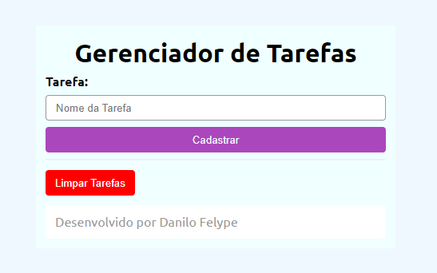

# (👉ﾟヮﾟ)👉 Introdução
Gerenciador de Tarefas em PHP
Este é um simples gerenciador de tarefas desenvolvido em PHP, que permite aos usuários adicionar, visualizar e limpar tarefas. O sistema utiliza sessões para armazenar as tarefas adicionadas, garantindo que elas persistam entre diferentes requisições HTTP.

# 🔨🧐 **Funcionalidades Principais:** 
``Adicionar Tarefa:`` Os usuários podem inserir o nome de uma nova tarefa em um formulário e cadastrá-la no sistema.
``Visualizar Tarefas:`` As tarefas cadastradas são exibidas em uma lista, permitindo aos usuários visualizá-las facilmente.
``Limpar Tarefas:`` Há a opção de limpar todas as tarefas cadastradas com um único clique, fornecendo uma maneira conveniente de reiniciar a lista de tarefas.
# Componentes Principais:
PHP: O código PHP é responsável por gerenciar as sessões de usuário, armazenando e manipulando as tarefas cadastradas.
HTML/CSS: A interface do usuário é criada utilizando HTML e estilizada com CSS, proporcionando uma experiência amigável e intuitiva para o usuário.

#  **Breve explicação dos elementos do código** ToDoList

``isset``
A função isset() é utilizada para verificar se uma variável está definida e não é nula. Ela retorna true se a variável existe e possui um valor diferente de null, caso contrário retorna false.

``$_SESSION``
$_SESSION é uma variável superglobal em PHP usada para armazenar dados de sessão do usuário. Esses dados são acessíveis em diferentes páginas durante uma sessão e são mantidos no servidor.

``foreach``
foreach é uma estrutura de controle usada para iterar sobre arrays ou objetos em PHP. Ele executa um bloco de código para cada elemento no array ou objeto.

``session_start()``
session_start() é uma função usada para iniciar uma nova sessão ou retomar uma sessão existente. Ela precisa ser chamada antes de acessar ou definir variáveis de sessão ($_SESSION).

``array()``
array() é uma função utilizada para criar um novo array em PHP. Ele pode ser usado de várias maneiras, como criar um array vazio ou inicializar um array com elementos.

``$_GET``
$_GET é uma variável superglobal que é usada para coletar dados enviados por meio do método GET em um formulário HTML. Os dados são acessíveis por meio de chaves associadas aos parâmetros passados na URL.

``array_push()``
array_push() é uma função utilizada para adicionar um ou mais elementos ao final de um array em PHP. Ela modifica o array original adicionando os novos elementos.

``var_dump()``
var_dump() é uma função usada para exibir informações detalhadas sobre uma ou mais variáveis, incluindo o tipo e o valor. É útil para depurar e entender a estrutura das variáveis em PHP.

``unset()``
unset() é uma função utilizada para destruir uma variável especificada, tornando-a não definida. Pode ser usada para liberar a memória ocupada por uma variável ou remover um elemento específico de um array.

# ✍️(◔◡◔)  **Autor** 

[Danilo Felype Lima](https://github.com/DaniloFelype)

  
  
